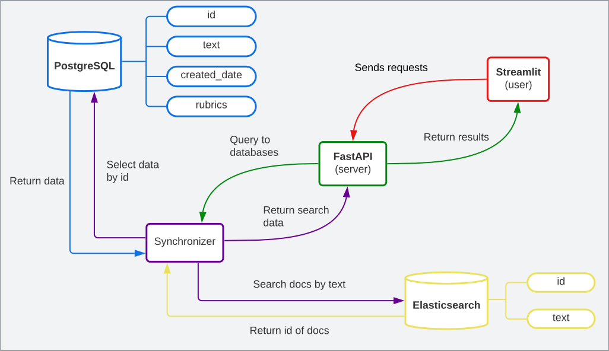
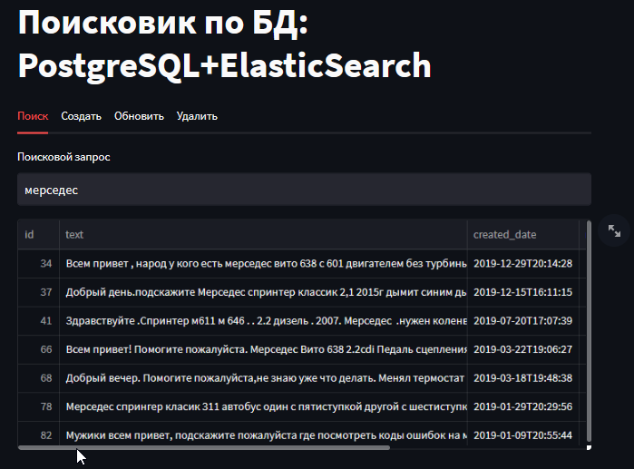

# Поисковик документов в базе данных 

 
 
 
 
 


## Описание
Проект по мотивам тестового 
[задания](https://karpovilia.notion.site/Python-67777c95bdbe4e59856c59b707349f2d)
для поиска данных в базе по текстовой информации.
Проект реализован в виде веб-сервиса с применением сборки
отдельных контейнеров 
(*PostgreSQL*, *Elasticsearch*, *FastAPI*, *Streamlit*)
через *docker-compose*.

## Визуал
### Схема поиска по тексту

### Структура приложения
```commandline
db-search-text\
│
├── backend\
│   ├── data\
│   │   └── posts.csv
│   │
│   ├── src\
│   │   ├── root\
│   │   │   ├── api\
│   │   │   │   ├── routers.py    # url адреса API
│   │   │   │   ├── schemas.py    # модели валидации данных
│   │   │   │   ├── utils.py
│   │   │   │   └── __init__.py
│   │   │   │
│   │   │   ├── databases\
│   │   │   │   ├── elastic.py
│   │   │   │   ├── postgres.py
│   │   │   │   ├── synchronizer.py
│   │   │   │   └── __init__.py
│   │   │   │
│   │   │   ├── config.py     # настройка host-ов и port-ов backend
│   │   │   └── __init__.py
│   │   │
│   │   └── main.py
│   │
│   ├── .dockerignore
│   ├── Dockerfile
│   └── requirements.txt
│
├── docker\
│   ├── docker-compose-db.yml         
│   ├── docker-compose-kibana-es.yml  
│   └── docker-compose.yml            # главный файл запуска приложения
│
├── frontend\
│   ├── src\
│   │   ├── api.py     # взаимодействие с api
│   │   ├── config.py  # настройка host-ов и port-ов frontend
│   │   ├── forms.py   # формы для заполнения
│   │   ├── main.py
│   │   └── tabs.py    # логика для вкладок
│   │
│   ├── .dockerignore
│   ├── Dockerfile
│   └── requirements.txt
│
├── images\
│   ├── front.png
│   └── schema.svg
│
├── .gitignore
├── README.md
└── troubles.md    # встретившиеся проблемы
```
### Скрин сайта

## Запуск
Запуск через *Docker*, находясь в корне:

`docker-compose -f docker/docker-compose.yml up`

+ После сборки контейнеров, потребуется n-ое время, 
чтобы веб-сервис заработал корректно, так как Elasticsearch 
"разогревается" медленно.

После запуска сервисов можно локально открыть по ссылкам:
+ Веб-сервис:

  [http://localhost:8501](http://localhost:8501)

+ Документацию API:

  [http://localhost:8000/docs](http://localhost:8000/docs)


## Материалы
+ Postgres
    - [The Complete Python/PostgreSQL Course 2.0](https://pysql.tecladocode.com/section05/lectures/06_psycopg2_cursors_and_queries/)
    - [Tutorial: Loading Data into Postgres using Python and CSVs](https://www.dataquest.io/blog/loading-data-into-postgres/)
    - [Upload Data to PostgreSQL](https://theinformationlab.nl/2022/01/03/upload-data-to-postgresql/)
    - [Database Connections in Python: Extensible, Reusable, and Secure](https://medium.com/opex-analytics/database-connections-in-python-extensible-reusable-and-secure-56ebcf9c67fe)
+ Elasticserach
    - [How to Use Elasticsearch in Python](https://dylancastillo.co/elasticsearch-python/)
    - [Load CSV Data Into Elasticsearch Using Python](https://medium.com/@sumukhi.cv/load-csv-data-into-elasticsearch-using-python-11e14b4d4c99)
    - [Начало работы с Elasticsearch в Python. Часть 2](https://medium.com/nuances-of-programming/%D0%BD%D0%B0%D1%87%D0%B0%D0%BB%D0%BE-%D1%80%D0%B0%D0%B1%D0%BE%D1%82%D1%8B-%D1%81-elasticsearch-%D0%B2-python-%D1%87%D0%B0%D1%81%D1%82%D1%8C-2-412796dcb213)
    - [YouTube: плейлист](https://www.youtube.com/watch?v=YLgE6vCuVpo&list=PLlKID9PnOE5jzJmRYfY0Rs1axrlH4-Qe_&index=11)
+ FastAPI
    - [YouTube: плейлист 1](https://www.youtube.com/watch?v=7IdfnjXsdN4&list=PLeLN0qH0-mCVQKZ8-W1LhxDcVlWtTALCS)
    - [YouTube: плейлист 2](https://www.youtube.com/watch?v=UkwpJyvf8CA&list=PLlKID9PnOE5jiWTTsshCXdz5qvg8JWezX)
+ Docker
    - [Serving a Machine Learning Model with FastAPI and Streamlit](https://testdriven.io/blog/fastapi-streamlit/)
    - [Docker networks explained](https://accesto.com/blog/docker-networks-explained-part-2/)
    - [FastAPI-Streamlit-Docker-NLP](https://github.com/subhasisj/FastAPI-Streamlit-Docker-NLP)
    - [Configuring a postgresql db with your dockerized fastapi app](https://www.jeffastor.com/blog/pairing-a-postgresql-db-with-your-dockerized-fastapi-app)
    - [Запускаем PostgreSQL в Docker: от простого к сложному](https://habr.com/ru/articles/578744/)
+ Kibana (доп.)
    - [Docker-Compose made Easy with Elasticsearch and Kibana](https://levelup.gitconnected.com/docker-compose-made-easy-with-elasticsearch-and-kibana-4cb4110a80dd)
    - [Elasticsearch and Kibana installation using Docker Compose](https://blog.devgenius.io/elasticsearch-and-kibana-installation-using-docker-compose-886c4823495e)

